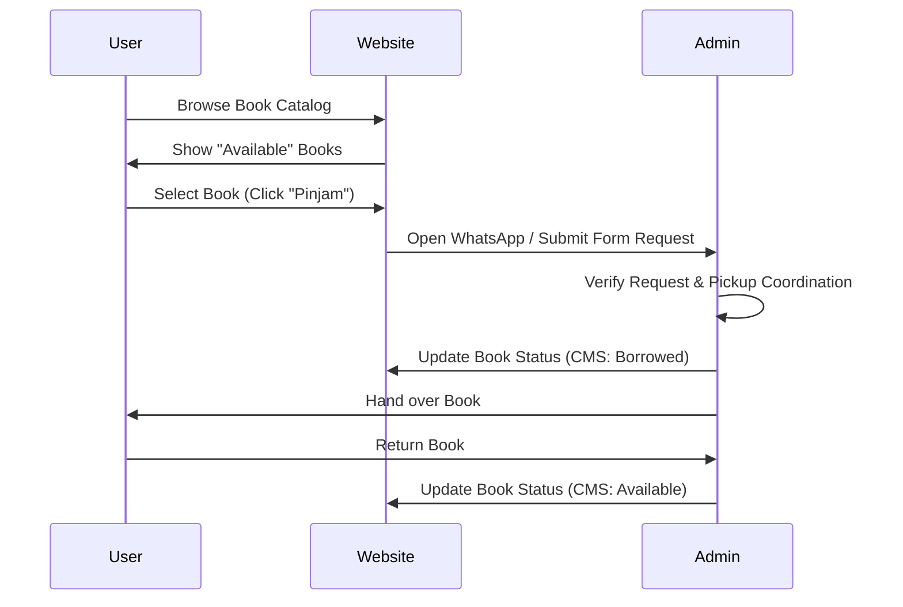

# Product Requirements Document (PRD): Majang Buku Community Website

## 1. Project Overview

**Majang Buku** is a vibrant book community based in Lumajang. The goal of this project is to build a premium company community profile website that showcases their unique identity, cozy vibe, and various literary activities. The website will serve as a digital hub for existing members and a welcoming portal for potential new members.

## 2. Goals

- **Brand Identity**: Establish a professional yet cozy digital presence for Majang Buku.
- **Showcase Activities**: Highlight key community activities like _Book Picnic_, _5 AM Club_, and _Silent Reading_.
- **Information Hub**: Provide clear information about the community's history (Biography), upcoming events, and common questions (FAQ).
- **Engagement**: Use high-end, interactive design elements to "wow" visitors.

## 3. Target Audience

- Book lovers and literacy enthusiasts in Lumajang and surrounding areas.
- Potential partners and sponsors.
- Existing community members looking for event updates.

## 4. Content Structure (Pages)

### 4.1 Home

- **Hero Section**: A high-impact carousel inspired by `alanmenken.com`.
- **Carousel Design**:
  - Vertical strips (strips horizontally aligned).
  - **Proposed Strips**: _Book Picnic_, _5 AM Club_, _Silent Reading_, _LCW (Literacy Camp & Workshop)_.
- **Call to Action**: Links to join the community or view events.

### 4.2 Biography

- **Fields Expected in CMS**:
  - **Title** (Text)
  - **Subtitle** (Text, Optional)
  - **Content** (RichText, required to support URL/Links)
- **Story**: The origin of Majang Buku and the meaning behind the name.
- **Mission & Vision**: Empowering the community through literacy.
- **Mascot Introduction**: Featuring the iconic orange cat.

### 4.3 Events

- **Upcoming Events**: A list or grid of scheduled activities managed via CMS.
- **Event Details**: Date, time, location, and description.
- **Past Events Gallery**: Optional overview of successful past gatherings.

### 4.4 FAQ

- **Dynamic FAQ Section**: Searchable or categorized list of questions.
- **Topics**: How to join, membership fees (if any), event locations, hardware requirements (bringing books).

### 4.5 Social Media

- **Fields Expected in CMS**:
  - **Name** (Text): Platform name (e.g., Instagram).
  - **URL** (Text): Link to the profile.
  - **Order** (Number): Display order in the sidebar.
  - **Active** (Checkbox): Toggle visibility.
  - **Icon** (Select): Platform-specific icon style.
- **Integration**: Links are displayed in the sidebar footer across all pages.

### 4.6 Library (Pinjam Buku)

- **Book Catalog**: A grid of books available for community borrowing.
- **Availability Tracking**:
  - Real-time counter showing "X available out of Y total books".
  - Toggle to filter exclusively by "Available Now".
- **Catalog Filters (Frontend - Dynamic)**:
  - **All Collections**: Show everything.
  - **Dynamic Categories**: Any categories added via the "Categories" collection in Payload CMS (e.g., Anak-Anak, Remaja, Langka).
  - **Paling Sering Dibaca**: Popular books based on borrow frequency.
- **Borrower List (Admin/Transparency)**:
  - A dedicated view (or internal CMS table) showing current active borrowers.
  - Fields: `Book Title`, `Borrower Name`, `Borrow Date`, `Expected Return`.
- **Fields Expected in CMS**:
  - **Book Categories** (New Collection): Title (Text), Slug (Text).
  - **Books**:
    - **Title** (Text, Required)
    - **Author** (Text, Required)
    - **Description** (Text, Optional)
    - **Cover Image** (Upload: Media)
    - **Cover Image URL** (Text, Optional): For external image hosting to save S3 storage.
    - **Categories** (Relationship to `BookCategories`, hasMany): To enable dynamic filters.
    - **ISBN/SKU** (Text, Optional)
    - **Owner/Donator** (Text, Optional): To acknowledge who contributed the book.
    - **Borrow Count** (Number, Read-only): Incremented automatically by the borrow system to track popularity.
  - **Status** (Select):
    - `Available`
    - `Borrowed`
    - `Reference Only` (Not for borrowing)
- **Borrowing Records**: Internal collection to track who borrowed what and when.

## 5. Design Requirements

### 5.1 Aesthetics

- **Theme Color**: Primary Orange (`#F78750`).
- **Style**: Minimalist, warm, and cozy.
- **Strict Rules**:
  - **No Gradients**: Use solid colors or subtle patterns.
  - **No AI Slop**: Custom, intentional assets and layout.
  - **Premium Feel**: Focus on smooth transitions and high-quality typography.

### 5.2 Typography

- **Primary Font**: **Clearface** (Serif). This font should be used for headings and body text to maintain a classic, literary feel.

### 5.3 Media

- **Images**: Warm-toned photography of reading sessions.

## 6. Functional Features

- **Interactive Carousel**: Custom-built vertical expansion carousel.
- **Content Management**: All text-based content, events, and FAQ items must be editable via the CMS.
- **Responsive Design**: Fully optimized for Desktop, Tablet, and Mobile (carousel should adapt to horizontal scrolling or stacked view on mobile).

### 6.1 Borrowing Flow (Pinjam Buku)

1. **Discovery**: User explores the "Library" catalog.
2. **Selection**: User clicks on a book to see its details and current availability status.
3. **Request**:
   - If `Available`, a "Pinjam Buku" button appears.
   - User fills a simple form (Name, WA Number, Proposed Return Date).
   - Alternatively, a direct WA link with a pre-filled message specifying the book title.
4. **Fulfillment**:
   - Admin receives the request and coordinates the physical hand-over (e.g., at the next _Book Picnic_).
   - Admin updates the book status to `Borrowed` in the CMS.
5. **Return**:
   - Once returned, Admin marks the book back as `Available` and records the return date.

## 7. Technical Stack

- **Framework**: Next.js 16 (App Router).
- **CMS**: Payload CMS 3.0 (Headless).
- **Package Manager**: pnpm v9 (v9.15.9) via Corepack.
- **Styling**: CSS Modules & SCSS (for Admin customization).
- **Database**: PostgreSQL with `@payloadcms/db-postgres` (Supabase Managed).
- **Testing**: Vitest (Integration) and Playwright (E2E).
- **Deployment**: Vercel (Frontend) and Supabase (Managed PostgreSQL).

## 8. Development Progress

- [x] Project Scaffolding (Next.js + Payload 3.0)
- [x] Collection Schemas (Users, Media, Events, FAQ, SocialMedia, Books, BookCategories, BorrowingRecords)
- [x] Global Schemas (BiographyPage, EventsPage, FaqPage)
- [x] Custom Admin UI (Logo, Icons)
- [x] Automated Borrowing Logic (Hooks to update book status and borrow counts)
- [x] Basic Frontend Structure (Layout, Navbar, BottomBar)
- [x] Interactive Strips Hero Component
- [x] Library Page (Search, Sort, Filter)
- [x] Integration & E2E Tests

## 9. Success Metrics

- **Engagement**: Time spent on the interactive homepage.
- **Conversion**: Number of clicks on "Join Community" or "View Events".
- **Performance**: Lighthouse score > 90 in all categories.
- **Reliability**: Passing integration and E2E tests for core flows.
